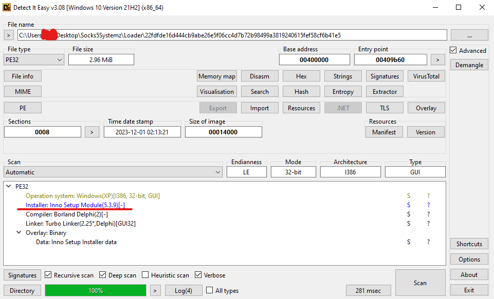
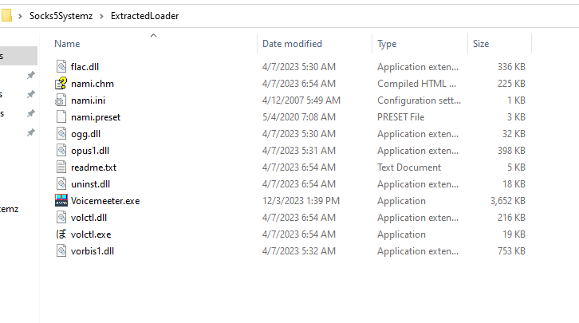
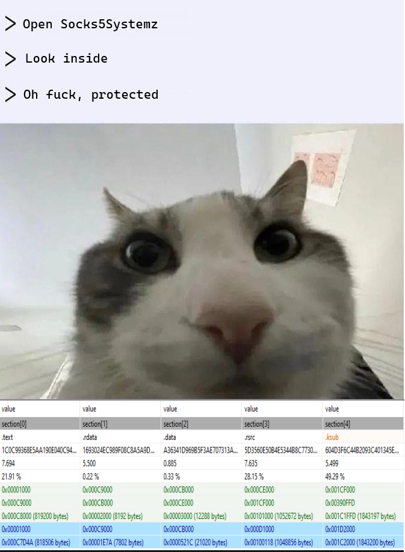
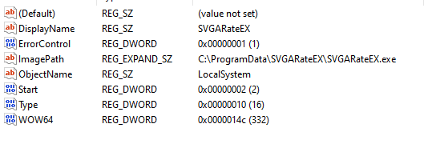
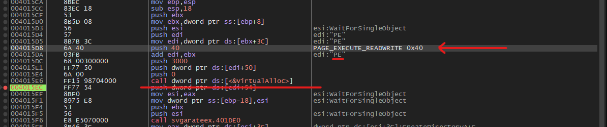
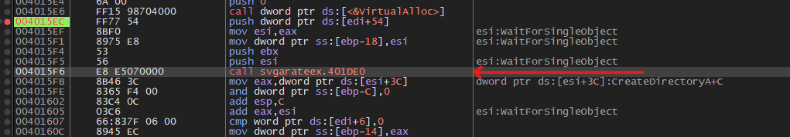
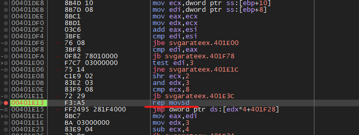
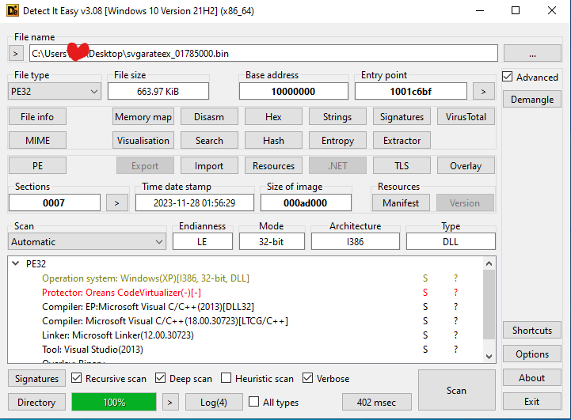
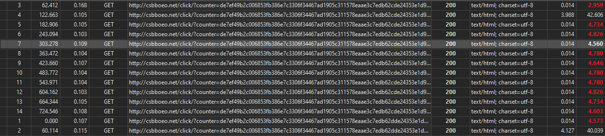
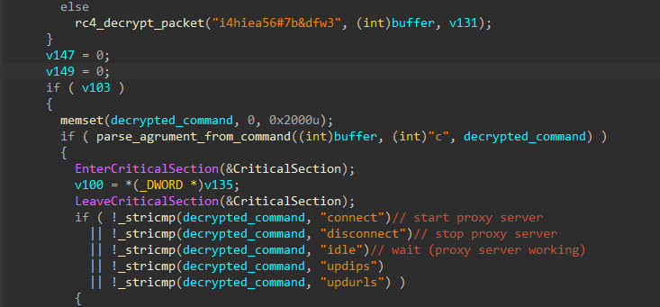

Loader : [Malware Bazaare](https://bazaar.abuse.ch/sample/22fdfde16d444cb9abe26e5f06cc4d7b72b98499a3819240615fef58cf6b41e5/)

Unpacked files : [Unpac.me](https://www.unpac.me/results/0bb17dae-7192-42df-aa90-c14215b1a661?hash=d380580f5ee79d082f97c198ffc5185abefcc539a1e49f94ae208589605aaba1#/)

Dumped module : [dump here](assets/svgarateex_01785000.bin)

# Introduсtion

Socks5Systemz появившийся в 2016 прокси-ботнет. Главной задачей которого является превращения вашего пк в прокси сервер. Полученные прокси продают или используют для иных целей. Ботнет навел много шума в сми, поэтому я не мог отказать себе в том, чтобы поковырять его.

# Loader

В виде первичного лоадера они используют бесплатный Inno Setup написанный на delphi



Я попробовал несколько программ для распаковки, и все они требовали пароль для распаковки файла. Но они позволили узнать точные названия файлов, которые находились внутри. Обладая данной информацией, я быстренько откопал все файлы при помощи everything с зараженной машины.



Вместе с вредоносом в установщик добавлена вполне легитная программа volctl.exe.

И дальнейшим моим шагом был анализ полученного бинаря. Внутри была примерно такая картина...



Бинарь был накрыт неизвестным мне протектором, так еще и не хотел стартовать вручную. Я решил посмотреть на действия в системе которые он совершает после установки. Самым важным было создание службы SVGARateEX, под которой он запускался после перезапуска системы.



# Main module

Далее нужно было найти где же расположен главный функционал ботнета, посмотрев на то что он отправляет какие-то пакеты на сервер после запуска я решил поставить бряки на все функции которые были хоть как то связанны с соединением с интернетом.
Бряк сработал в выделенном малварем регионе rwx памяти, теперь стоило понять откуда он мапится туда. Самым банальным было атачнуться дебаггером сразу после старта малваря и поставить бряк на VirtualAlloc, так я и поступил.



После срабатывания бряка я увидел что он выделяет регион памяти с правами PAGE_EXECUTE_READWRITE. Проследив за этим адресом памяти я понял что именно в него загружается нужный нам модуль. Что интересно после создания потока PE заголовок полностью очищается.



Теперь оставалось найти место где в выделенный буфер записываются данные. Перейдя в первую функцию после вызова VirtualAlloc можем увидеть инструкцию rep movsd.



Инструкция rep movsd копирует n количество байт из регистра esi в регистр edi, в данный момент в регистре edi находится адрес выделенной ранее памяти, а в esi находится нужный нам модуль. Делаем дамп и можем продолжать анализ.

Сдампленный модуль готовый к анализу : [here](assets/svgarateex_01785000.bin)

P.s Если делаете дамп вручную, то вам нужно будет убрать 5 байт мусора, которые находятся перед заголовком MZ

# Protector



Видим что в качестве протектора выступает Oreans Code Virtualizer. В данном случае использовалась демо версия. Она не включает в себя макросы виртуализации и может только наложить мутацию на код. Сомнительным решением было накрывать бинари протектором, так как из-за него количество детектов только увеличивается.

Ps. В Voicemeeter.exe так же использовался данный протектор, но имя секции было изменено, поэтому DIE не смог определить название.

# Server communication
После полной инициализации модуля он создает главный поток, который начинает отправлять пакеты на сервер раз в минуту. Из-за большого размера функция не была подвержена мутации и я смог легко проанализировать ее в статике.



Пакет выглядит примерно так и содержит всю информацию о зараженном клиенте. До отправки пакет шифруется с использованием rc4 и статичным ключом ```i4hiea56#7b&dfw3```

```client_id=c1b0b3cc&connected=1&server_port=42522&debug=76&os=10.0.19044&dgt=1&dti=170163923```

В ответе сервер отправляет одну из 5 команд в зашифрованном виде



```connect``` - подключается к указанному в пакете ip и запускает прокси сервер (пакеты идут по tcp)<br>
```disconnect``` - отключается от клиента и выключает прокси сервер<br>
```idle``` - ожидание, прокси сервер продолжает работу<br>
```updips``` - обновляет ip клиента к которому проксируется трафик<br>
```updurls``` - получает список url и записывает его в файл ```save.dat```

Я тестировал его на виртуальной машине около часа и получив около 100к пакетов ни видел пакет с командой updurls, поэтому сказать точно для чего она используется не представляется возможным (все мелкие функции в мутации). Да и имя файла больше нигде не используется, поэтому вероятно это какая-то нереализованная фича.


