# Sample

[Loader](https://bazaar.abuse.ch/sample/946583a0803167de24c7c0d768fe49546108e43500a1c2c838e7e0560addc818/)

# Introduction

Smoke Loader довольно популярный лоадер малварей, семейство которого появилось в далеком 2014. Главной техникой его является использование нескольких довольно интересных шеллкодов.

# Shellcode loader

Открываем семпл в иде и видим множество рандомных вызовов функций из winapi. Все подобные вызовы являются простым мусором, который можно спокойно игнорировать. Из интересного тут только функция, которая маппит шелкод в память.

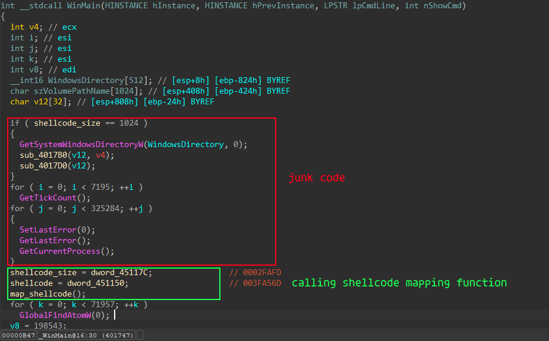

Функция выделяет пямять в куче, меняет защиту на rwx и записывает в нее шеллкод.

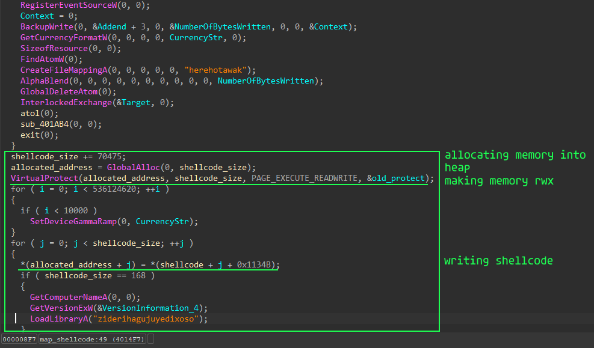

После просто вызывает его

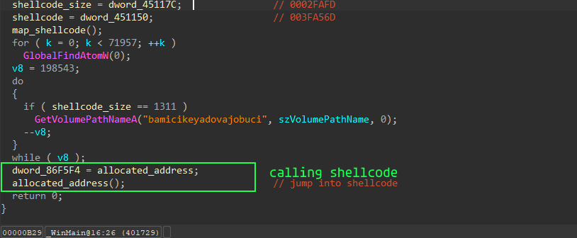


# Shellcode analysis

Полученный шеллкод я прогнал через несколько декомпиляторов, лучше всех с декомпиляцией справилась ида. На выходе получаем такой ентри поинт.

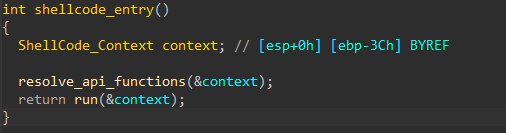

Открыв 1 функцию я сразу понял что она получает адреса разных winapi функций и помещает их в какую-то структуру. 

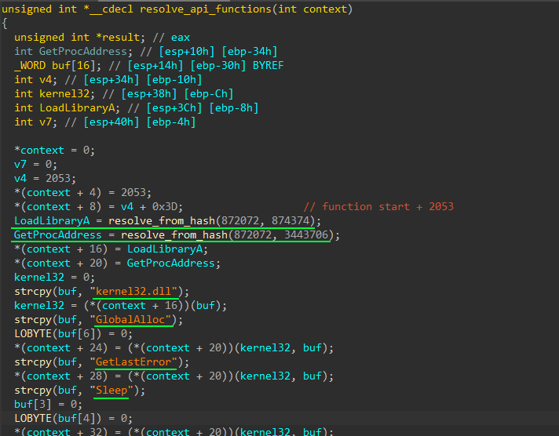

Воссозданная мной структура выглядит примерно так : 

```cpp
struct ShellCode_Context
{
  int pad;
  int shellcode_2_size;
  int *shellcode_2_address;
  int i;
  unsigned int *LoadLibraryA;
  unsigned int *GetProcAddress;
  unsigned int *GlobalAlloc;
  unsigned int *GetLastError;
  unsigned int *Sleep;
  unsigned int *VirtualAlloc;
  unsigned int *CreateToolhelp32Snapshot;
  unsigned int *Module32First;
  unsigned int *CloseHandle;
};
```
Применяем ее к нашему псевдокоду и получаем примерно такой результат. Фукнция хеширования тут довольно простенькая, использует алгоритм shl1_add.

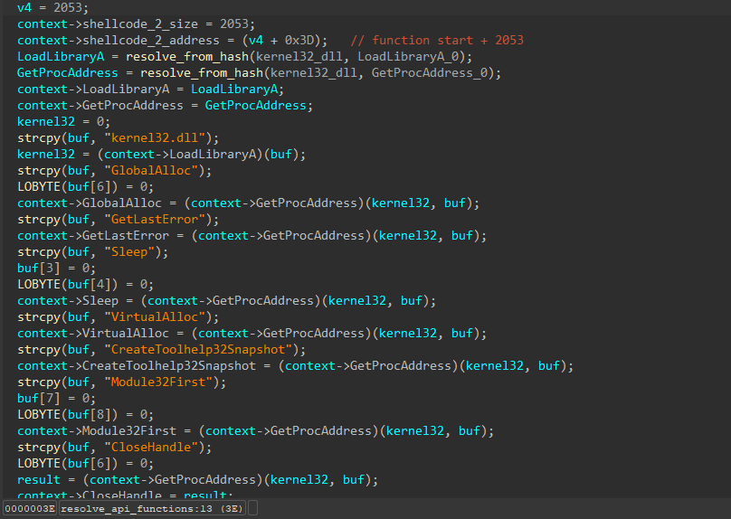

После получения всех адресов всех Апи функций он пытается создать лист всех модулей процесса и проверяет наличие первого модуля в списке. В целом мне не особо понятно зачем нужен этот кусок кода, да и никакой информации в интернете на этот счет я не нашел.

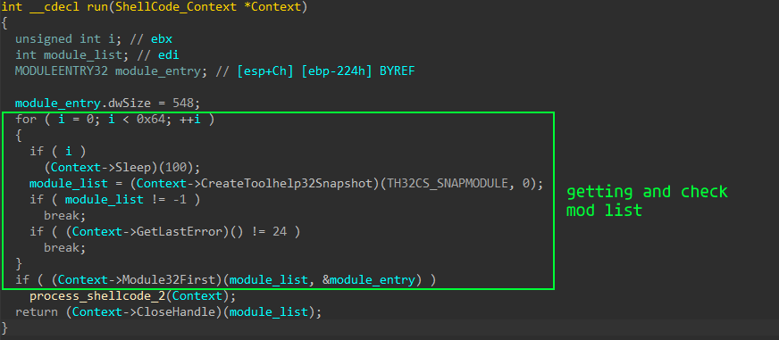

Изначально я предполагал что последующие функции нужны для расшифровки пакнутного бинаря и его корректной инициализации. Но оказалось что этот шеллкод нужен только для того, чтобы расшифровать и запустить второй шеллкод, который уже и будет выполнять основную работу.

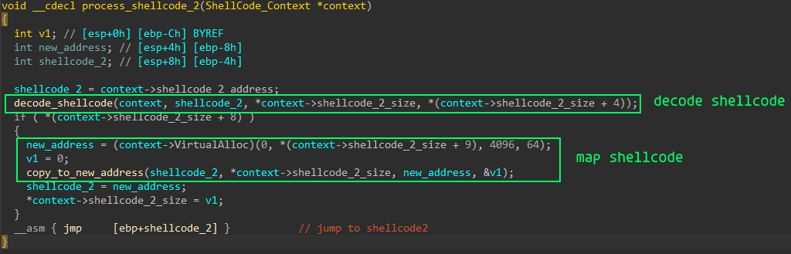

# Shellcode analysis 2

Одной из особенностей второго шеллкода, которая сразу кидается в глаза, является его размер, а именно почти 500кб. Это почти в 5 раз больше чем размер первого шеллкода. Вес самого шеллкода не велик около 3600 байт, а сразу после него расположен бинарный файл который и будет загружен в память.

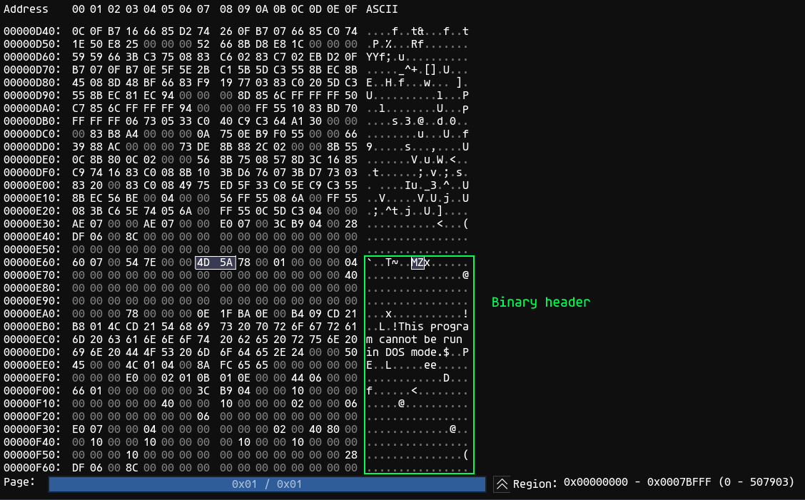

Как и в прошлом случае в самом начале он получается адреса нужных ему апи функций, единственным отличием является отсутствие хеширования.

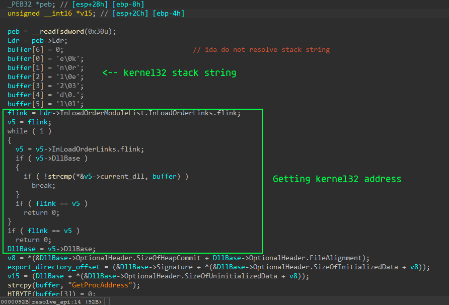

Интересной фишкой является то, что он не пытается получить доступ к полям структуры напрямую, а складывает оффсеты других полей для получения смешения нужного ему поля. Это интересное решение, которое не позволяет сразу понять к какому именно полю он пытается обратиться (в статике как минимум).

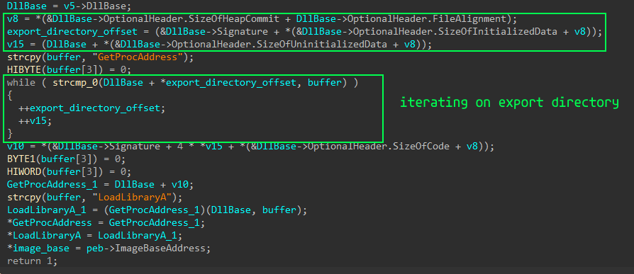

На этом моменте начинается самая интересная часть. Он выделяет в памяти место в которое копирует бинарь который в последующем будет загружен в память. Это место является временным, тк после он использует VirtualProtect для смены защиты по базовому адресу шеллкод лоадера. Смена защиты нужна чтобы полностью очистить его секции и записать туда наш вредоносный бинарник.

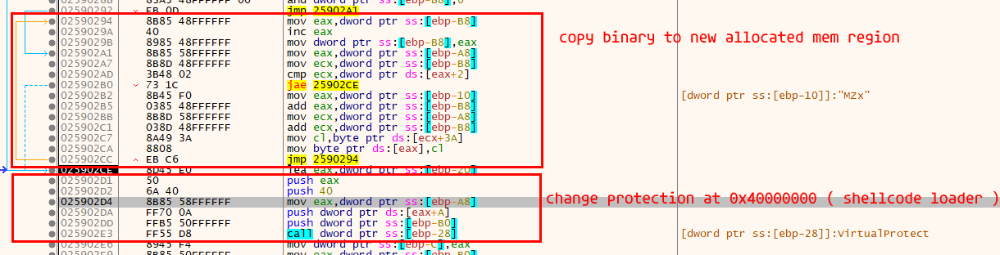

После того как шеллкод лоадер был перезаписан нашим вредоносом он проворачивает стандартные действия которые выполняет загрузчик виндовс. Фиксит адреса релоков, если базовый адрес отличается от того что записан в PE заголовке. Фиксит таблицу импортов. Все эти куски в дебагере выглядят очень большими, поэтому покажу только фикс импортов ( код выглядит не очень ).

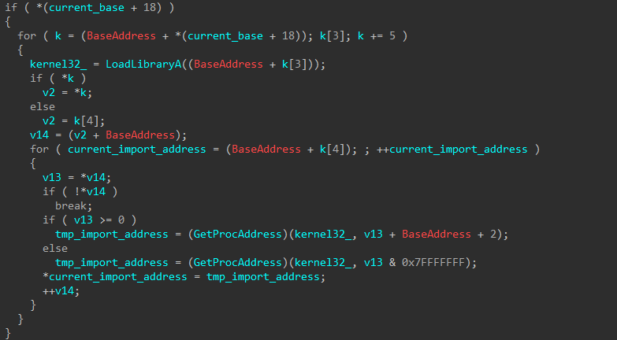

После успешной загрузки и подготовки к выполнению он вызывает энтрипоинт


